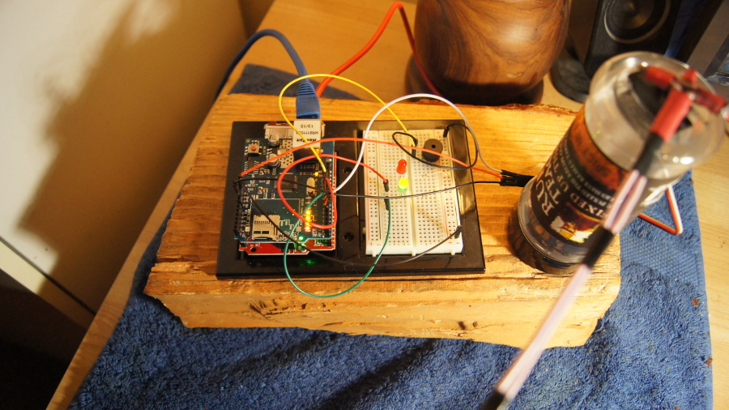
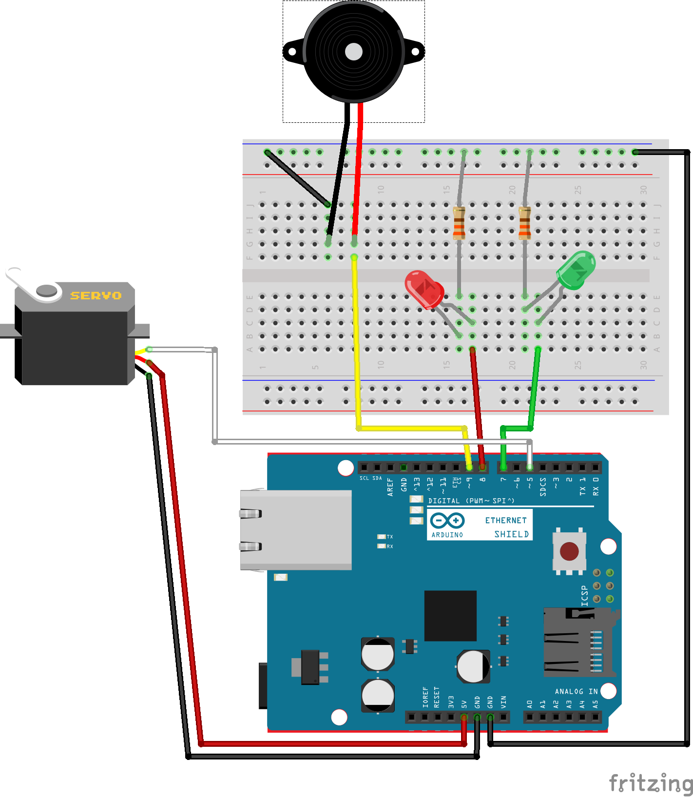

# IoTFaceSlapper
A device that allows people to hit things over the internet

https://youtu.be/6PhGe3AHHIw

### Hardware required

1. Arduino Uno or compatible (pictured: SparkFun Redboard)
2. Arudino-compatible ethernet shield
3. Buzzer
4. Servo
5. 2x LEDs
6. 2x 330Ohm resistors
7. Breadboard
8. Something dangerous to swing

### Source:

https://github.com/kellybs1/IoTFaceSlapper/blob/master/FaceSlapper/FaceSlapper.ino

### 3rd party tools:

http://playground.arduino.cc/Code/TwitterLibrary
http://arduino-tweet.appspot.com/

### Fritizing diagram

### References
Arduino web server:  
http://www.instructables.com/id/Easy-Basic-Arduino-Ethernet-Controller/?ALLSTEPS

